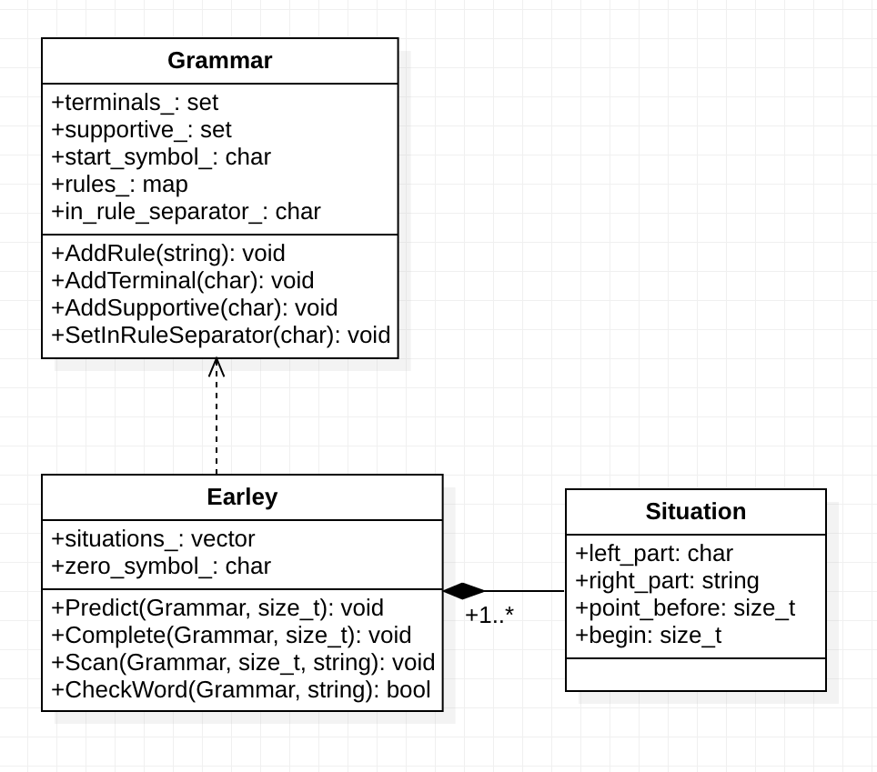

# *Алгоритм Эрли*

_Решетникова Дарья, Б05-123_

__*Входные данные*__

Программа принимает на вход грамматику и слово и сообщает, выводится ли слово в грамматике.
Грамматика подается на вход как имя файла.
Файл с грамматикой должен иметь следующий вид:
- В первой строке все нетерминалы
- Во второй строке все терминалы 
- В третьей строке знак, выступающий разделителем в правилах грамматики
- Далее идут строки с правилами (одно правило -- одна строка)

Далее, при успешном построении грамматики по входным данным, вводится слово через стандартный поток ввода
и выдается ответ.
В качестве символов грамматики нельзя использовать '$'. Начальным символом выступает S.
Если хочется проверить наличие пустого слова, то в качестве самого слова вводится $.

__*Запуск программы*__

Чтобы запустить программу, необходимо скачать данный репозиторий, перейти в скачанный каталог, далее использовать команды:
- mkdir build
- cd build
- cmake -DCMAKE_BUILD_TYPE=Debug .. 
- make
- make tests
- ../bin/Earley

*Результат покрытия кода тестами можно посмотреть в файле index.html в каталоге build/coverage.*

