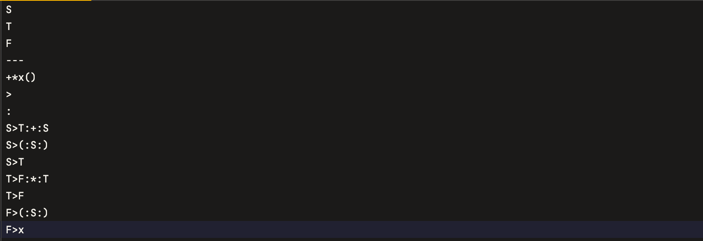
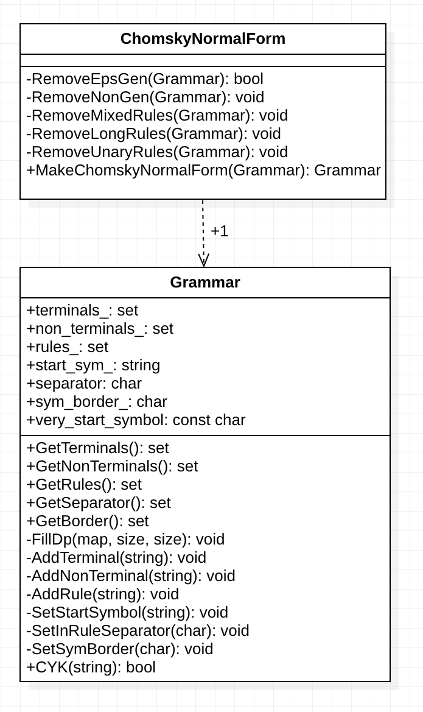

# *Алгоритм Кока-Янгера-Касами с приведением к Нормальной Форме Хомского*

_Решетникова Дарья, Б05-123_

__*Входные данные*__

Программа принимает на вход грамматику и слово и сообщает, выводится ли слово в грамматике.
Грамматика подается на вход как имя файла.
Файл с грамматикой должен иметь следующий вид:
- В начальных строках все нетерминалы, причем стартовый нетерминал -- самый первый
- После нетерминалов следует строка "---"
- Далее в одной строке все терминалы без пробелов 
- После этого в новой строке знак, выступающий разделителем в правилах грамматики между левой и правой частями
- Затем в новой строке знак, выступающий разделителем в правилах грамматики между символами в правой части
- В следующих строках до конца файла идут правила

**Пример**

Далее вводится число слов для проверки. После вводятся слова и выдается ответ.
В качестве символов грамматики нельзя использовать $.
Если хочется проверить наличие пустого слова, то в качестве самого слова вводится $.

__*Запуск программы*__

Чтобы запустить программу, необходимо скачать данный репозиторий, перейти в скачанный каталог, далее использовать команды:
- mkdir build
- cd build
- cmake -DCMAKE_BUILD_TYPE=Debug .. 
- make
- make tests
- ../bin/CYK

*Результат покрытия кода тестами можно посмотреть в файле index.html в каталоге build/coverage.*

